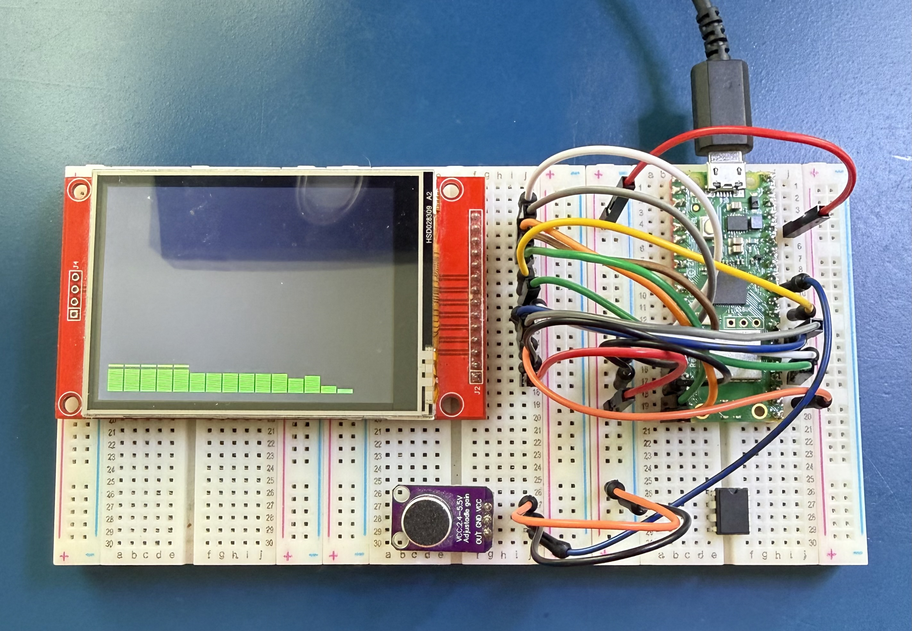

# Raspberry Pi Pico Spectrum Analyzer


A real-time audio spectrum analyzer for the Raspberry Pi Pico W: dual-core, DMA-driven, fixed-point dual-resolution FFT, and six visualizations at 50 fps on a 2.8" ILI9341 TFT.

## Project Overview

A real-time audio spectrum analyzer that pushes the RP2040 hard: both cores, DMA
everywhere, a fixed-point dual-resolution FFT, and a double-buffered 8-bit
indexed renderer streaming full frames to the panel at the SPI bus limit.

### Measured on hardware

| | Before | Now |
|---|---|---|
| Frame rate | 10.7 fps | **50.6 fps**, every theme (bound by the SPI transfer) |
| Sample-to-glass latency | not measured | **~28 ms** (data capture to last pixel sent) |
| Audio | 22 kHz timer IRQ per sample, ring overflowing | **48 kHz** free-running ADC + DMA, zero CPU per sample, no drops |
| FFT | 64-pt float (344 Hz bins) | 1024-pt + 256-pt bass FFT, **11.7 Hz bass bins**, 187.5 spectra/s |
| Frequency accuracy | - | **< 0.2 %** (41 Hz - 12 kHz), level **+/-0.3 dB** (host-tested) |
| Display | 16 bars, flicker (clear-then-draw) | 320 log-spaced columns, 6 themes, flicker-free full-frame compositing |

`sys 250 MHz | SPI 62.5 MHz | DSP 2.2 ms per 5.33 ms hop | draw 2-6 ms hidden behind a 19.8 ms transfer`

### Features

- **Audio:** MAX4466 electret mic on ADC0, 48 kHz with crystal-accurate sampling
- **Analysis:** 1024-pt block-floating-point real FFT for mids and highs, plus a 4th-order CIC
  decimator (48 k -> 3 kHz) feeding a 256-pt bass FFT; crossfaded at 380-600 Hz onto 320
  log-spaced columns (30 Hz - 16 kHz); parabolic-interpolated dominant frequency readout
- **Display dynamics:** per-column noise-floor tracking with a 1:3 downward expander (silence
  reads dark, fixed electrical spurs vanish), AGC with a noise-tracking bottom, instant-attack
  / 30 dB/s release ballistics, +3 dB/oct tilt so music reads flat
- **Themes:** Spectrum, Analyzer, Spectrogram, Terrain, Nova, Scope (see below)
- **Controls:** touch (swipe, tap, long press) and a serial command console
- **Resilience:** HardFault capture (PC/LR reported after reboot), watchdog, and a
  crash-loop escape into BOOTSEL so the board can always be re-flashed over USB

## Architecture

```
 Core 0 (audio)                                    Core 1 (render)
 ──────────────                                    ───────────────
 ADC 48 kHz ──DMA──> 2048-sample ring              drain hop queue, touch, serial
   (control DMA channel re-arms forever)           ── just-in-time ──
 every 256 samples (5.33 ms):                      latest mailbox frame
   CIC /16 -> 3 kHz bass stream                    theme update + draw into BACK buffer
   1024-pt FFT (48 kHz) + 256-pt FFT (3 kHz)       HUD / popup (save-under)
   -> 320 log columns (dBFS, Q8)                   wait for FRONT stream to finish
   noise-floor expander, AGC, ballistics           swap, stream new FRONT:
   ├── mailbox (seqlock)  ─────────────────────>     DMA IRQ palette-expands 8-row
   └── hop queue (SPSC, every hop) ────────────>     strips into ping-pong RGB565
                                                     buffers -> SPI0 @ 62.5 MHz
```

Key decisions:

| Decision | Why |
|---|---|
| 8-bit indexed framebuffer, double-buffered (2 x 75 KB) | Two RGB565 frames will not fit in 264 KB; indexed frames do, and a palette gives free "dim" twins (`idx \| 0x80`) for translucent overlays, reflections and trails |
| Palette expansion in the DMA IRQ | ~25 us of CPU per 0.65 ms strip; the SPI never idles |
| SPI mode 3, not mode 0 | The PL022 inserts an idle gap between words when CPHA=0; mode 3 streams back-to-back (21.7 -> 19.8 ms per frame) |
| `PICO_CLOCK_ADJUST_PERI_CLOCK_WITH_SYS_CLOCK=1` | Otherwise SDK 2.x moves clk_peri to 48 MHz on overclock and SPI caps at 24 MHz |
| Fixed-point FFT with block floating point | No FPU on the M0+; conditional per-stage scaling keeps quiet signals precise (-76 dB error floor vs a double DFT) |
| Dual-resolution FFT | 46.9 Hz bins cannot resolve bass; a CIC-decimated 256-pt FFT gives 11.7 Hz bins for about 0.15 ms |
| Just-in-time draw start | Frame rate is set by the transfer, while latency stays about draw + one transfer |

### Hardware Components

| Component | Model | Interface | Purpose | Status |
|-----------|-------|-----------|---------|--------|
| Microcontroller | Raspberry Pi Pico W | - | Main processor (RP2040) | ✅ Working |
| Display | ILI9341 2.8" TFT | SPI0 | 320x240 16-bit color | ✅ Working |
| Touch Controller | XPT2046 | SPI1 | Resistive touch input | ✅ Driver Ready |
| Microphone | MAX4466 | ADC | Electret mic with gain | ✅ Working |
| Audio Input | 3.5mm Jack | ADC | Line-level audio (future) | 🔄 Planned |

### Pin Assignments (Tested & Verified)

```
Pico W GPIO Assignments:
├── Display (SPI0) - ✅ Working
│   ├── GP16 - MISO (optional: SPI self-test)
│   ├── GP17 - CS (Chip Select)
│   ├── GP18 - SCK (Clock @ 62.5MHz)
│   ├── GP19 - MOSI (Data)
│   ├── GP20 - DC (Data/Command)
│   ├── GP21 - RST (Reset)
│   └── GP22 - BL (Backlight - connected to 3.3V)
│
├── Touch Controller (SPI1) - ✅ Driver Ready
│   ├── GP12 - MISO (Data In)
│   ├── GP13 - CS (Chip Select)
│   ├── GP14 - SCK (Clock @ 2MHz)
│   ├── GP15 - MOSI (Data Out)
│   └── GP11 - IRQ (Interrupt, active low)
│
├── Audio Input - ✅ Working
│   └── GP26 (ADC0) - MAX4466 Microphone
│
└── Status/Debug
    └── USB - Serial output for debugging
```

### Detailed Wiring: ILI9341 Display

| Display Pin | Function | Pico W GPIO | Physical Pin | Notes |
|-------------|----------|-------------|--------------|-------|
| VCC | Power | 3.3V | Pin 36 | Or 5V if module has regulator |
| GND | Ground | GND | Pin 38 | Any GND pin works |
| CS | Chip Select | GP17 | Pin 22 | SPI0 CS |
| RESET | Reset | GP21 | Pin 27 | Hardware reset |
| DC/RS | Data/Command | GP20 | Pin 26 | Register select |
| SDI/MOSI | Data Out | GP19 | Pin 25 | SPI0 TX |
| SCK | Clock | GP18 | Pin 24 | SPI0 SCK |
| LED/BL | Backlight | 3.3V or GP22 | Pin 36 or 29 | Can use PWM on GP22 |
| SDO/MISO | Data In | GP16 | Pin 21 | Optional: enables the 62.5 MHz read-back self-test |

**Important Notes:**
- Most ILI9341 modules operate at 3.3V logic levels
- Some modules have onboard regulators and can accept 5V on VCC
- Backlight (LED pin) can be connected directly to 3.3V for always-on
- Or connect to GP22 for software control with PWM dimming
- MISO is optional as ILI9341 is write-only for most operations

### Detailed Wiring: MAX4466 Microphone

| Microphone Pin | Function | Pico W GPIO | Physical Pin | Notes |
|----------------|----------|-------------|--------------|-------|
| VCC | Power | 3.3V | Pin 36 | Powers the amplifier |
| GND | Ground | GND | Pin 38 | Any GND pin works |
| OUT | Audio Output | GP26 (ADC0) | Pin 31 | Analog audio signal |

**Important Notes:**
- MAX4466 outputs analog audio signal centered at VCC/2 (~1.65V)
- Built-in adjustable gain via onboard potentiometer
- Output range: 0.6V to 2.0V typically
- Adjust gain pot clockwise for higher sensitivity
- Start with low gain to avoid clipping, increase as needed

**Wiring Tips:**
- Keep wires short to minimize noise pickup
- Route audio signal away from SPI and power lines if possible
- The MAX4466 is quite sensitive - start testing with low gain
- You can add a 0.1µF capacitor between VCC and GND for stability (optional)

### Detailed Wiring: XPT2046 Touch Controller

| Touch Pin | Function | Pico W GPIO | Physical Pin | Notes |
|-----------|----------|-------------|--------------|-------|
| VCC | Power | 3.3V | Pin 36 | Powers the touch controller |
| GND | Ground | GND | Pin 38 | Any GND pin works |
| CS | Chip Select | GP13 | Pin 17 | SPI1 CS (active low) |
| CLK | Clock | GP14 | Pin 19 | SPI1 SCK @ 2MHz |
| DIN | Data In | GP15 | Pin 20 | SPI1 MOSI (data to touch IC) |
| DO | Data Out | GP12 | Pin 16 | SPI1 MISO (data from touch IC) |
| IRQ | Interrupt | GP11 | Pin 15 | Optional, active low when touched |

**Important Notes:**
- XPT2046 is the touch controller commonly found on ILI9341 display modules
- Many 2.8" ILI9341 displays have the XPT2046 integrated on the same PCB
- The touch controller uses a **separate SPI bus (SPI1)** from the display (SPI0)
- IRQ pin goes LOW when the screen is touched (useful for power saving)
- Touch coordinates are read as 12-bit ADC values and calibrated to screen pixels
- The controller operates at 3.3V logic levels
- ⚠️ **Pico W Note:** GP23-25,29 are used by CYW43 wireless chip (not available on pins)

**Wiring Tips:**
- If your display module has an integrated touch controller, it may share some pins
- Check your module's pinout - some have all pins on one connector
- The IRQ pin is optional but recommended for responsive touch detection
- Touch calibration may be needed - adjust `TOUCH_X_MIN/MAX` and `TOUCH_Y_MIN/MAX` in code
- Test with light finger pressure - resistive touch requires physical contact

## Development Setup

### Prerequisites

- Docker Desktop (the toolchain and Pico SDK live in the image)
- `picotool` for flashing: `brew install picotool`
- Python 3 with `pyserial` for serial monitoring

### Build, flash, monitor

```bash
docker compose build dev                 # once: toolchain image
./scripts/deploy.sh --monitor 10         # build in Docker, flash, tail serial for 10 s
./scripts/deploy.sh --no-build           # flash the existing build
./tests/run_host_tests.sh                # DSP unit tests on the host (no SDK needed)
```

`deploy.sh` flashes with `picotool load -f -x`, which forces a running board into BOOTSEL
over USB, so no button press is needed. Copying the UF2 to the `RPI-RP2` drive is avoided
on purpose: on recent macOS the FSKit FAT driver can hang mid-copy.

If the board is ever unresponsive, hold BOOTSEL while plugging it in, then run
`./scripts/deploy.sh --no-build`.

## Project Structure

```
include/                     src/
  config.h      pins, clocks   main.c                boot, overclock, core split
  platform.h    RAMFUNC shim   core/shared.c         seqlock mailbox, hop queue, controls
  audio/                       core/crash.c          HardFault capture, watchdog, BOOTSEL escape
    spectrum.h  core contract  audio/audio_task.c    ADC DMA ring, CIC, per-hop analysis (core 0)
    dsp.h                      audio/dsp.c           dual-FFT columns, expander, AGC, ballistics
    fft_q.h                    audio/fft_q.c         block-floating-point real FFT
  display/                     display/ili9341.c     panel init, IRQ-driven strip streaming
    gfx.h theme.h ...          display/gfx.c         double-buffered indexed fb, save-under
                               display/renderer.c    frame loop, HUD, input, stats (core 1)
                               display/themes/*.c    the six themes
tests/test_dsp.c               host tests vs a double-precision DFT
scripts/deploy.sh              build + flash + monitor
```

## Visualization Themes

| # | Theme | What it shows |
|---|---|---|
| 1 | **Spectrum** | 64 bars, sunset gradient by height, gravity-driven peak caps, dithered floor reflection, dB grid |
| 2 | **Analyzer** | 320-point curve with glow fill, peak-hold trace, dBFS/Hz graticule, live dominant-frequency readout |
| 3 | **Spectrogram** | Scrolling "inferno" waterfall, 93.75 rows/s (2.4 s of history), kept in the framebuffer itself |
| 4 | **Terrain** | The last 40 spectra as synthwave ridge lines receding to a horizon, with occlusion and sub-line smooth scrolling; bass-pulsed striped sun |
| 5 | **Nova** | 96 mirrored spokes on a rotating ring, hue by frequency, palette-fade motion trails, bass-pulsed core, beat shockwaves |
| 6 | **Scope** | Rising-edge-triggered phosphor oscilloscope with persistence and auto-ranging |

## Controls

| Touch | Serial (115200, any key) | Action |
|---|---|---|
| Swipe right / left | `n` / `p`, `1`-`6` | Next / previous / pick theme |
| Tap | `h` | Toggle the performance HUD |
| Long press | `t` | Cycle input: mic, 440 Hz, 1 kHz, sweep, chord (synthetic, injected into the ADC ring) |
| | `a` | Toggle AGC |
| | `s` | Status (clocks, last reset cause, crash PC if any) |
| | `f` | Dump the framebuffer (base64 palette + pixels) for off-board screenshots |

Stats print every 2 s:

```
fps 50.6 | draw 1.81/1.89 ms | stream 19.76 ms | lat 27.2/29.8 ms | dsp 2215/2243 us | skip 0 | qdrop 0 | peak 1000.8 Hz -11.9 dBFS | top -14.9
```

## Tuning

- **Clocks:** `SYS_CLOCK_KHZ`, `SYS_VREG_VOLTAGE`, `DISPLAY_SPI_STREAM_HZ` in `include/config.h`
- **Analysis:** FFT sizes, hop size and range in `include/audio/spectrum.h`
- **Dynamics:** tilt, noise-floor tracking, expander, AGC and release constants at the top of
  the AGC section of `src/audio/dsp.c`
- **Mic gain:** the MAX4466 trimpot. Its self-noise at max gain dominates the ADC's.

## Known limitations

- MISO (GP16) is not wired on this build, so the 62.5 MHz write/read-back self-test reports
  `n/a`; signal integrity is judged by eye.
- Latency is measured from sample capture to the last pixel leaving SPI. The panel's own
  ~79 Hz scan adds up to one more refresh (the TE pin is not wired).
- Above the 480 Hz crossover the display is normalised to spectral density, so pure tones
  read ~6 dB lower there than below (the numeric peak readout stays calibrated for tones).
- The historical notes in `docs/` describe the earlier single-core design.

## References

- [Raspberry Pi Pico Datasheet](./datasheets-and-manuals/Datasheet_RP-008307-DS-1-pico.pdf)
- [ILI9341 Display Datasheet](./datasheets-and-manuals/Datasheet_ILI9341.pdf)
- [MAX4466 Microphone Datasheet](./datasheets-and-manuals/Datasheet_MAX4466.pdf)
- [XPT2046 Touch Controller Datasheet](./datasheets-and-manuals/Datasheet_XPT2046.pdf)
- [Pico C/C++ SDK Documentation](https://www.raspberrypi.com/documentation/pico-sdk/)

---
